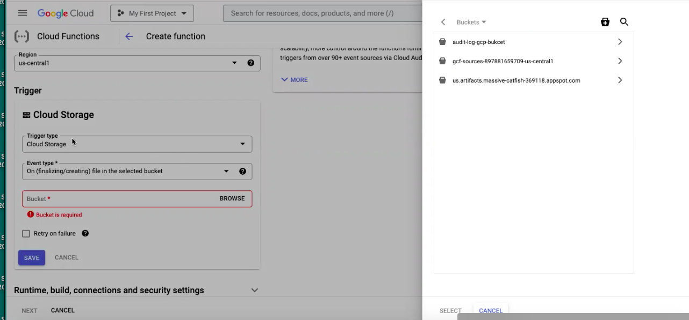
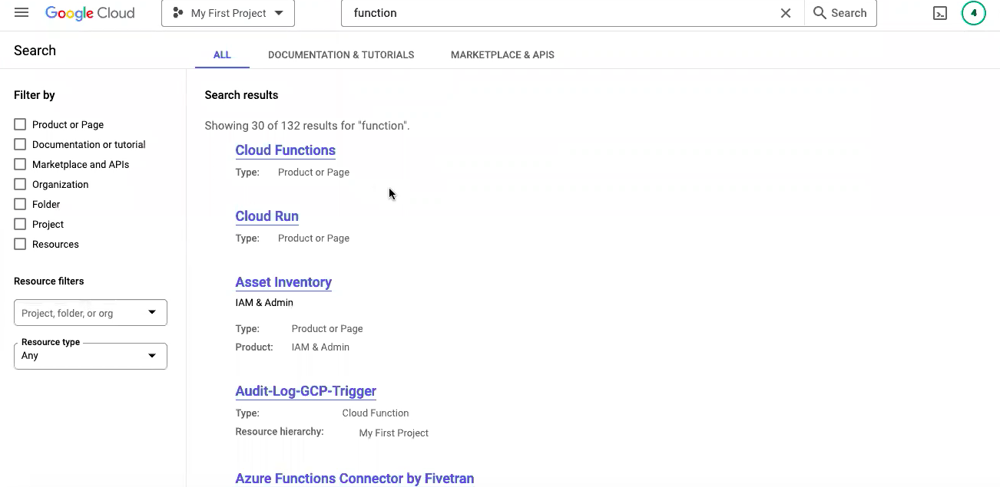
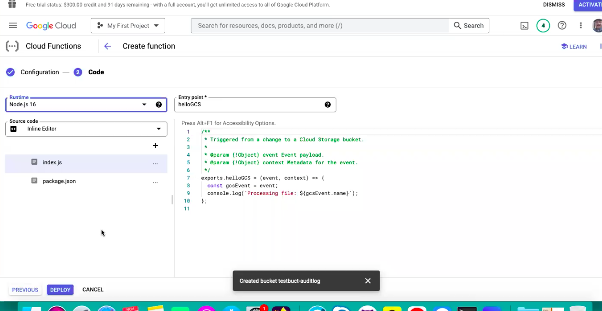
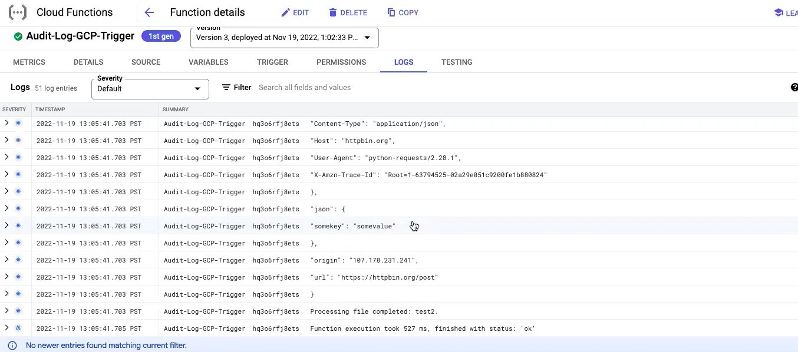

# Cloud Functions triggers

	You can set up Cloud Functions to execute in response to various scenarios by specifying a trigger for your function.
         Triggers can be HTTP(S) requests or one of a number of supported events. This page provides an overview of the triggers supported by Cloud Functions.

## What is Cloud Storage?

	This page provides an overview of Cloud Storage and how it works.

	Cloud Storage is a service for storing your objects in Google Cloud. An object is an immutable piece of data consisting of a file of any format. 
	You store objects in containers called buckets. All buckets are associated with a project, and you can group your projects under an organization.
	Each project, bucket, and object in Google Cloud is a resource in Google Cloud, as are things such as Compute Engine instances.

	After you create a project, you can create Cloud Storage buckets, upload objects to your buckets, and download objects from your buckets.
	You can also grant permissions to make your data accessible to principals you specify, or - for certain use cases such as hosting a website - accessible to everyone on the public internet.

##  Diagram below outlines the basic architechture 
   

##  How to configure bucket and setup funtion 

## list and  Select bucket

## Setup Cloud Storage

 

#  Select Cloud Function and then select python3.8 in Runtime

## setup main.py

#this pacakge is for accessing the file from bucket
from google.cloud [google.cloud] import storage
#this package for making network calls
import requests

##  sending logs using token

#dest_url = "https://cloud.community.humio.com/api/v1/ingest/hec/raw"
#dest_token1 = xxxxxxxxxxxxxxxxxxxxxxxxxxxxxxxx
#header1 = {'Content-Type': 'application/json', 'Authorization': 'Bearer ' + dest_token1}

#initializing the storage object
storage_client = storage.Client()
#trigered when new file is available
def hello_gcs(event, context):
    """Triggered by a change to a Cloud Storage bucket.
    Args:
         event (dict): Event payload.
         context (google.cloud.functions.Context): Metadata for the event.
    """
    #this holds the file metadata ie filename,bucket etc
    file = event
    #initiliazing the bukcet object
    bucket = storage_client.get_bucket(event['bucket'])
    #initializing blob (file in bucket)
    blob = bucket.blob(event['name'])
    #read from file as string and then converting it to lines
    contents = blob.download_as_string().splitlines()
    #loop through the lines

    for lineContent in contents:
         #print the line item
         print(lineContent)

    ############Network call start
    #URL for http POST request (for REST API)
    url = 'https://httpxxxxxxxx/post [httpbin.org]'
    # request payload (the input to the server)
    myobj = {'somekey': 'somevalue'}
    #REST CALL to server
    x = requests.post [requests.post](url, json = myobj)
    #get the response back from server and print
    print(x.text)
    ##########Network call end
    print(f"Processing file completed: {file['name']}."

## Logs file after trigger

