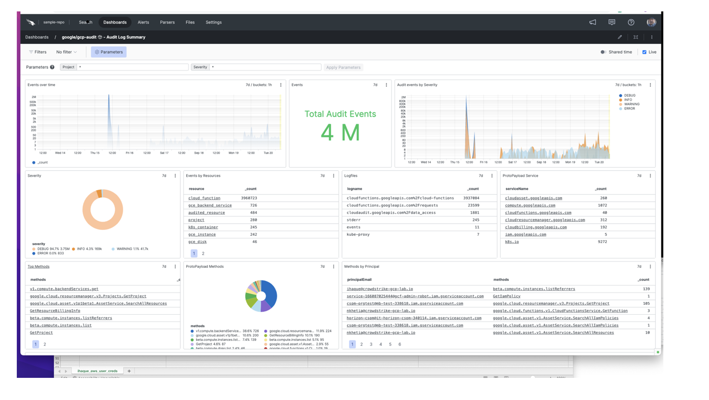
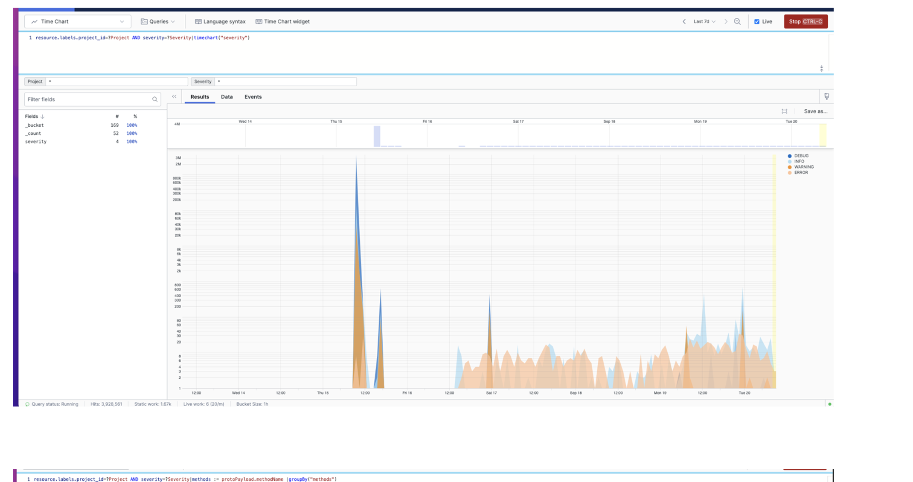
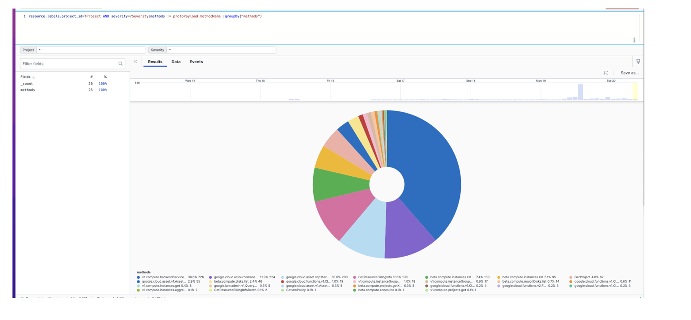
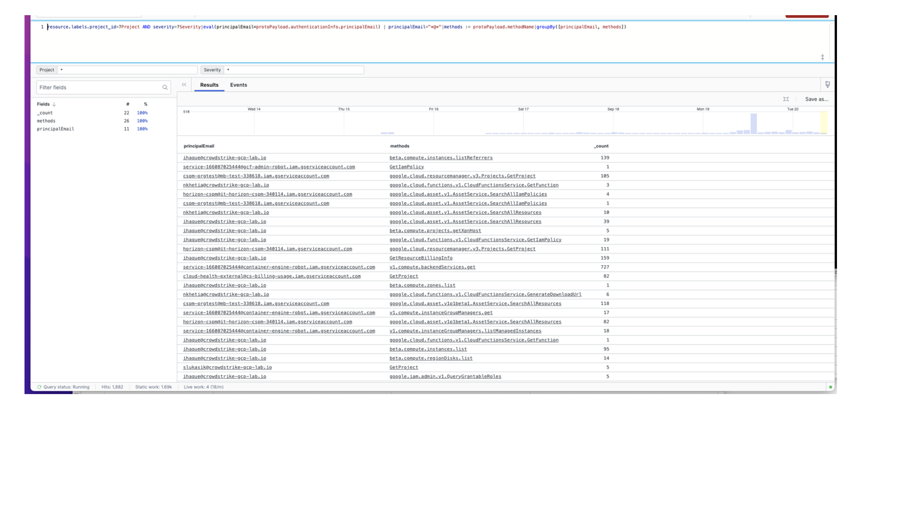

# Deploying and implanting Cloud function in GCP to transfer logs to Logscale for analysis
    Cloud Functions is an event-driven serverless computer platform. They can subscribe to events across a suite of cloud service and trigger based on those changes.

## Steps to configure
     
- In the Google Cloud console, go to the Cloud Storage Buckets page. Go to Buckets.
- Click Create bucket.
- On the Create a bucket page, enter your bucket information.
- In the Google Cloud search -> Cloud Function -> function name
- Trigger Type -> Cloud Storage
- Select -> correct bucket
- Event Type: Select -> On(finalizing/creating) file in the selected bucket
- Cloud Functions -> Configuration -> Runtime -> python3.8
- Add code to  main.py
- Update the code based on the requirement and then select “Deploy”. This will save the configuration

## Setup function to transfer events  log to Logscale:

     •	First, we will need to get token by generating from a logscale repository. Click on “repository” then select “settings”.
       Next, you will select “ingest tokens” and then select “add token” and provide a token name.  You will then assign parser and save it. This will also generate a token.  Copy that token onto main.py python file in Cloud function. 

## Example below shows how to setup token in main.py file.
   
    

http = urllib3.PoolManager()
dest_url = "https://cloud.community.humio.com/api/v1/ingest/hec/raw"
dest_token1 = xxxxxxxxxxxxxxxxxxxxxxxxxxxxxxxx
header1 = {'Content-Type': 'application/json', 'Authorization': 'Bearer ' + dest_token1}

        http.request('POST', dest_url,body=newevent,headers=header1)

## Sample DashBoard

# 
