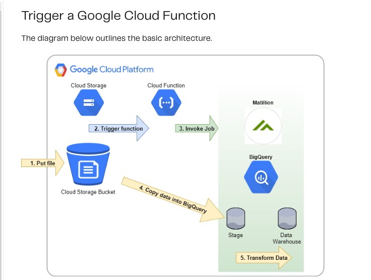
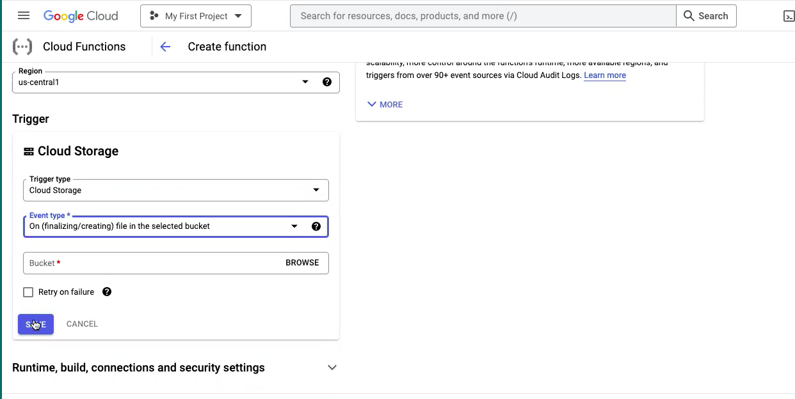
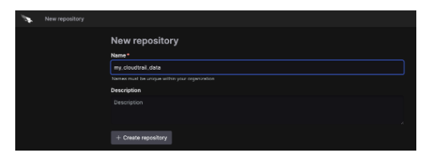

 

# GCP Function: Cloud Storage(bucket)  Logs to Falcon/LogScale Shipper

## Configure and Setup GCP Function with Cloud Storage as a service 
- Cloud Storage is a service for storing your objects in Google Cloud. An object is an immutable piece of data consisting of a file of any format. You store objects in containers called buckets.

## Setup

- In the Google Cloud console, go to the Cloud Storage Buckets page. Go to Buckets.
- Click Create bucket.
- On the Create a bucket page, enter your bucket information.
- In the Google Cloud search -> Cloud Function -> function name 
- Trigger Type -> Cloud Storage 
- Select -> correct bucket 
- Event Type: Select -> On(finalizing/creating) file in the selected bucket
- Cloud Functions -> Configuration -> Runtime -> python3.8
- Add code to  main.py 

## Flow  Chart Diagram

# Configure CloudStorage

## Prepare LogScale
- Setup the Ingest Repository
- select, or create a target ingest repository

# Installing LogScale(Humio) Log Collector on Linux

[LogCollector](https://library.humio.com/humio-server/log-shippers-log-collector-install-linux.html)

- create an ingest token, or use the default token

## configure ingest parsing

parseJson(handleNull=empty) | parseTimestamp(field=timestamp)

## Support

This package is supported by our product support team. If you have any issues implementing or running this package, please go to support@crowdstrike.com for assistance.

Setuop parser in logscale repository and generate token that will be used to configure (pub/sub) GCP function.

## Example configuring python script ( main.py)  to transfer audit-log  to LogScale Repository

Example below shows how to setup token in main.py file.

- python

http = urllib3.PoolManager()
dest_url = "https://cloud.community.humio.com/api/v1/ingest/hec/raw"
dest_token1 = xxxxxxxxxxxxxxxxxxxxxxxxxxxxxxxx
header1 = {'Content-Type': 'application/json', 'Authorization': 'Bearer ' + dest_token1}

## Dependencies
- Log Output

This package requires minimum parsing configuration in the parser.

parseJson(handleNull=empty) | parseTimestamp(field=timestamp)

## Time Zones
The parser will try to automatically detect timestamps in the logs, including time zone information. If no time zone is present though, the parser will assume the timestamp i
s UTC time. The best solution is to include timestamp information in the logs, but you can also modify the parser to provide a different default. Find the timezone argument i
n the findTimestamp function to change it.

---

 

<h3>
WE STOP BREACHES
</h3>

